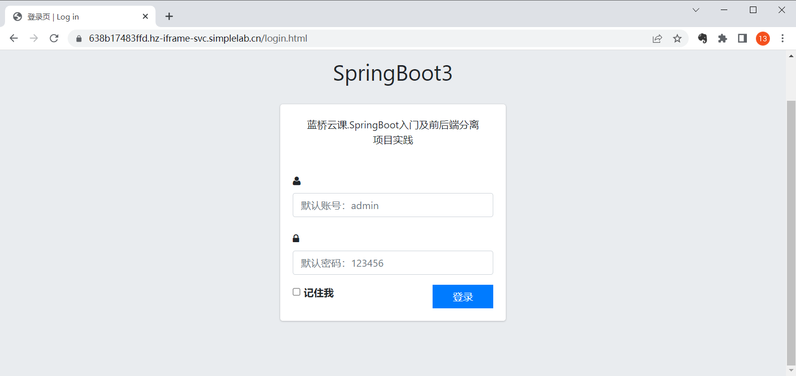
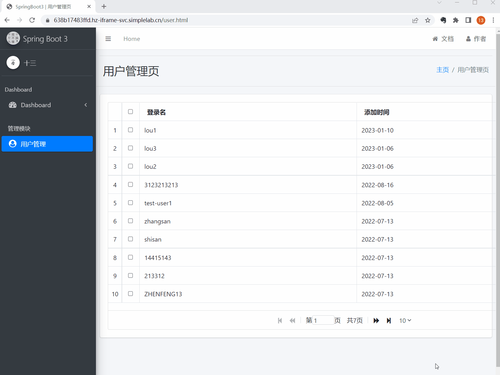
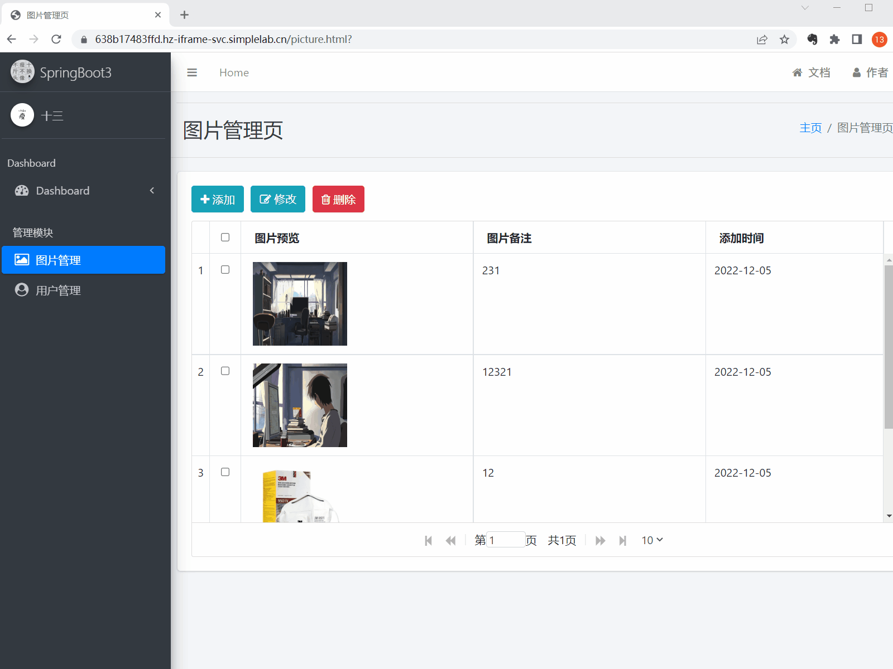
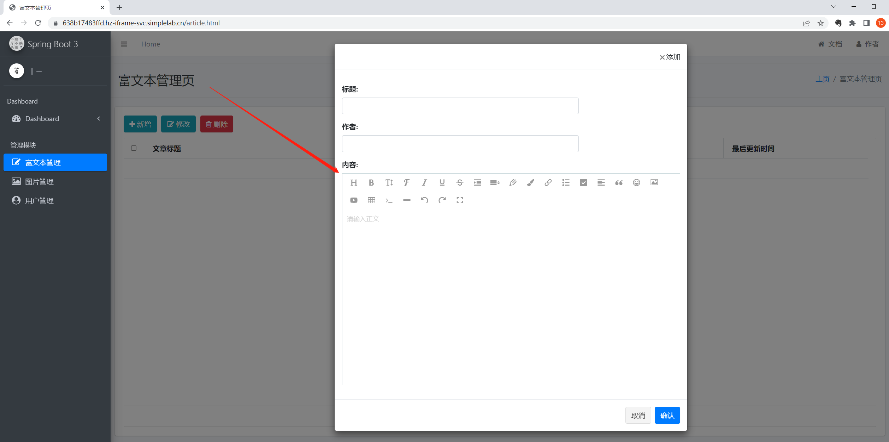

# Spring Boot 前后端分离实战项目

## （一）简介

本课程是一个 Spring Boot 技术栈的实战类课程，课程共分为 3 个部分，当前仓库为课程的实战项目源码。前面两个部分为基础环境准备和相关概念介绍，第三个部分是 Spring Boot 项目实践开发。Spring Boot 介绍、前后端分离、API 规范等内容旨在让读者更加熟悉 SpringBoot 及企业开发中需要注意的事项并具有使用 SpringBoot 技术进行基本功能开发的能力；最后的项目实战为课程的主要部分，会带着大家实际的开发一个前后端分离的 Spring Boot 实践项目，让大家实际操作并从无到有开发一个线上项目，并学习到一定的开发经验以及其中的开发技巧，旨在让读者具有将 Spring Boot 真正应用于项目开发的能力；

## （二）部署

1.使用spring-boot-project-front-end.....文件夹下的.sql中建表

2.使用idea打开spring-boot-project-f.文件夹

3.使用idea连接数据库中的springboot3_db表

4.改变application.properties文件中的

```
spring.datasource.username=
spring.datasource.password=
```

5.运行Application

6.浏览器打开 http://localhost:8080/login.html 登录页

## （三）项目展示

下面的这个展示就是[原项目](https://github.com/imrewang/spring-boot-projects/tree/main/SpringBoot%E5%89%8D%E5%90%8E%E7%AB%AF%E5%88%86%E7%A6%BB%E5%AE%9E%E6%88%98%E9%A1%B9%E7%9B%AE%E6%BA%90%E7%A0%81)的展示哩

以下为实践项目的页面和功能展示，分别为：

- 登录页面



- 列表页面(分页功能)



- 图片上传功能



- 富文本编辑器整合使用



实践项目的主要功能和页面就是这些，通过项目展示大家也能够感受到，在实际应用开发中的高频次功能都已经实现，稍加修改就可以运用到企业开发中，整个项目的开发模式为前后端分离的模式，即 Spring Boot 提供后端接口，前端页面通过 Ajax 异步调用接口的方式与后端服务器进行交互并将数据填充至页面中，这也是目前企业开发中比较重用的开发模式，希望大家能够了解并且能够实际的上手开发。

## （四）总结

**1.Token**

所谓的Token，其实就是服务端生成的一串加密字符串、以作客户端进行请求的一个“令牌”。

当用户第一次使用账号密码成功进行登录后，服务器便生成一个Token及Token失效时间并将此返回给客户端，若成功登陆，以后客户端只需在有效时间内带上这个Token前来请求数据即可，无需再次带上用户名和密码。

**2.摘要算法**

摘要算法之所以能指出数据是否被篡改过，就是因为摘要函数是一个单向函数，计算f(data)很容易，但通过digest反推data却非常困难。

而且，对原始数据做一个bit的修改，都会导致计算出的摘要完全不同。摘要算法就是通过摘要函数f()对任意长度的数据data计算出固定长度的摘要digest。
